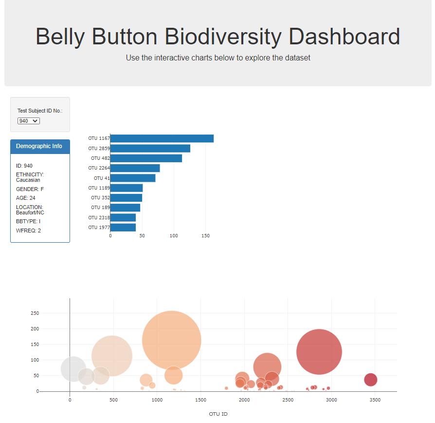

# Plot.ly  Belly Button Biodiversity 
## Java Script & HTML


In this repository, I built an interactive dashboard to explore the [Belly Button Biodiversity dataset](http://robdunnlab.com/projects/belly-button-biodiversity/), which catalogs the microbes that colonize human navels.

The dataset reveals that a small handful of microbial species (also called operational taxonomic units, or OTUs, in the study) were present in more than 70% of people, while the rest were relatively rare.

## Plotly- Steps followed to create Visualization

1. Use the D3 library to read in `samples.json`.

2. Create a horizontal bar chart with a dropdown menu to display the top 10 OTUs found in that individual.

* Use `sample_values` as the values for the bar chart.

* Use `otu_ids` as the labels for the bar chart.

* Use `otu_labels` as the hovertext for the chart.

  

3. Create a bubble chart that displays each sample.

* Use `otu_ids` for the x values.

* Use `sample_values` for the y values.

* Use `sample_values` for the marker size.

* Use `otu_ids` for the marker colors.

* Use `otu_labels` for the text values.


```
       // create bar chart
    var barTrace = {
      type: 'bar',
      x: otuValues,
      y: chartreadyIDS,
      orientation: 'h',
      text: barHoverText
    };
    var barData = [barTrace];
    Plotly.newPlot('bar', barData);
    // create bubble chart
    var bubbleTrace = {
      x: idValues,
      y: sampleValues,
      mode: 'markers',
      marker: {
        size: sampleValues,
        color: idValues
      },
      text: barHoverText
    }
    var bubbleData = [bubbleTrace]

    var bubbleLayout = {
      xaxis: {
        title: "OTU ID"
      }
    }

    Plotly.newPlot('bubble', bubbleData, bubbleLayout)

  });

}
```

4. Display the sample metadata, i.e., an individual's demographic information.

5. Display each key-value pair from the metadata JSON object somewhere on the page.


```'//  function for demographic info
function demographicData(selection) {
  // view data again
  d3.json('samples.json').then((data) => {
    // console.log(data)
    // all metadata
    var metaData = data.metadata
    // console.log(metaData);
    // selection metadata
    var selectionMD = metaData.filter(meta => meta.id.toString() === selection)[0];
    // console.log(selectionMD)
    // select demographic info from HTML-line31
    var demographicInfo = d3.select("#sample-metadata")
    // clear out info for new id
    demographicInfo.html("");
    // add to html
    Object.entries(selectionMD).forEach((key) => {
      demographicInfo.append("h5").text(key[0].toUpperCase() + ": " + key[1] + "\n");
    });
  });

};
```

6. Update all of the plots any time that a new sample is selected.



```
<body>

  <div class="container">
    <div class="row">
      <div class="col-md-12 jumbotron text-center">
        <h1>Belly Button Biodiversity Dashboard</h1>
        <p>Use the interactive charts below to explore the dataset</p>
      </div>
    </div>
    <div class="row">
      <div class="col-md-2">
        <div class="well">
          <h5>Test Subject ID No.:</h5>
          <select id="selDataset" onchange="optionChanged(this.value)"></select>
        </div>
        <div class="panel panel-primary">
          <div class="panel-heading">
            <h3 class="panel-title">Demographic Info</h3>
          </div>
          <div id="sample-metadata" class="panel-body"></div>
        </div>
      </div>
      <div class="col-md-5">
        <div id="bar"></div>
      </div>
      <div class="col-md-5">
        <div id="gauge"></div>
      </div>
    </div>
    <div class="row">
      <div class="col-md-12">
        <div id="bubble"></div>
      </div>
    </div>
  </div>

  <script src="https://cdnjs.cloudflare.com/ajax/libs/d3/5.5.0/d3.js"></script>
  <script src="https://cdn.plot.ly/plotly-latest.min.js"></script>
  
  <script src="app.js"></script>
  <!-- <script src="./static/js/bonus.js"></script> -->
  <script src="samples.json"></script>
  
</body>
```
